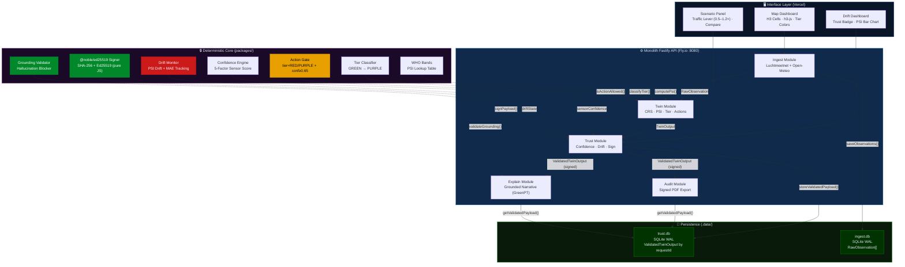

# 🌍 Amsterdam Pollution Twin Copilot

**Validated, Auditable Urban Pollution Digital Twin — Hack for Humanity 2026**

> AI-driven pollution monitoring that **refuses to hallucinate**. Every risk score, tier, and action recommendation is computed deterministically and signed before the AI ever sees it. No grounding? **Fallback to template.**

[](https://ams-pollution-twin.vercel.app/) [](https://nextjs.org) [](https://typescriptlang.org) [](./LICENSE)

**Core Capabilities:** Live Sensor Ingest · Deterministic CRS Scoring · H3 Geocell Heatmap · Scenario Simulation · Ed25519 Signed Audit PDF · Hallucination-Gated AI Explainer · Green AI Meter · Drift Monitor

<p align="center">
  
</p>

---

## 📋 Table of Contents

1. [Problem Statement](#-problem-statement)
2. [Solution Overview](#-solution-overview)
3. [Architecture](#-architecture)
4. [Technical Deep Dives](#-technical-deep-dives)
5. [Deterministic Pipeline](#-deterministic-pipeline)
6. [Safety & Hallucination Prevention](#-safety--hallucination-prevention)
7. [Local Setup](#-local-setup)
8. [Demo Walkthrough](#-demo-walkthrough)
9. [Project Structure](#-project-structure)
10. [Further Reading](#-further-reading)

---

## ❌ Problem Statement

AI-powered environmental monitoring sounds great — until it fails catastrophically:

| Failure Mode | What Happens | Real-World Impact |
|---|---|---|
| **Hallucination** | LLM invents pollution values not in sensor data | City triggers false alerts, public trust collapses |
| **No Grounding** | AI responses lack evidence from actual measurements | Operators can't verify recommendations |
| **No Auditability** | Decisions are black-box | Regulatory compliance fails, liability exposure |
| **Overconfident gaps** | System presents guesses as facts when sensors fail | Bad data triggers worse decisions than no data |
| **Undetected drift** | Model degrades silently over weeks | Systematic forecast errors go unnoticed |

Traditional environmental AI tools generate confident-sounding assessments with zero accountability. **Amsterdam Pollution Twin takes the opposite approach.**

---

## ✅ Solution Overview

Amsterdam Pollution Twin is a **deterministic-first digital twin** where every number is computed and signed before AI narrates it:

- 🗺️ **Live H3 geocell heatmap** — Amsterdam colored by CRS risk tier with real station timestamps in every tooltip
- 🔢 **Deterministic scoring** — PM2.5/NO₂ → PSI → CRS → tier → actions, all computed by rules engine, never by LLM
- 🔐 **Ed25519 signed payloads** — SHA-256 hash + cryptographic signature seals every output before export or explanation
- 📊 **Trust & drift monitoring** — 5-factor sensor confidence + PSI drift + rolling MAE tracking with automatic state degradation
- 📄 **Signed audit PDF** — one-click export with hash, signature, and step-by-step verification instructions
- 🧠 **Grounded AI explainer** — LLM reads only the signed payload; grounding validator blocks any number not present in data
- 🌿 **Green AI Meter** — exact token counts + energy/CO₂ estimate per explanation

**The AI is read-only. It cannot modify scores, unlock actions, or invent data.**

---

## 🏗 Architecture

> **Monolith since v2.** All five pipeline modules (ingest, twin, trust, audit, explain) run inside a single **Fastify TypeScript** process deployed to **Fly.io**. The frontend is a **Next.js 14** app on **Vercel**.



---

## 🔍 Technical Deep Dives

### 1. Deterministic CRS Scoring Engine

Pollutant measurements flow through WHO threshold bands into a Combined Risk Score:

```typescript
// packages/rules/src/index.ts
export const WHO_BANDS = {
  pm25: [
    { maxUgM3: 10,  psi: 0   },
    { maxUgM3: 25,  psi: 50  },
    { maxUgM3: 55,  psi: 100 },
    { maxUgM3: Infinity, psi: 200 },
  ],
  no2: [ /* ... */ ],
};

// CRS formula — deterministic, rules-based
const crs = clamp(
  avgPsi * (1 + persistence * 0.3)
         * sensorConfidence
         * (0.5 + exposureNorm * 0.5),
  0, 100
);
```

📁 [packages/rules/src/index.ts](./packages/rules/src/index.ts) · [services/twin/src/engine.ts](./services/twin/src/engine.ts)

### 2. 5-Factor Sensor Confidence

Trust is computed from five independent sensor quality dimensions:

```typescript
// services/trust/src/confidence.ts
sensorConfidence =
  completeness  * 0.25 +   // % sensors reporting
  timeliness    * 0.20 +   // % within freshness window
  calibration   * 0.25 +   // reference station score
  crossAgreement* 0.20 +   // inter-sensor correlation
  (1 - anomalyRate) * 0.10 // inverted anomaly fraction
```

| Factor | Weight | Source |
|---|---|---|
| Completeness | 25% | Fraction of expected stations reporting |
| Timeliness | 20% | Readings within 30-min freshness window |
| Calibration | 25% | Reference station calibration score |
| Cross-Agreement | 20% | Inter-sensor correlation within 2 km |
| Anomaly Rate | 10% | Inverted: fraction flagged as anomalous |

📁 [services/trust/src/confidence.ts](./services/trust/src/confidence.ts)

### 3. Ed25519 Cryptographic Signing

Every validated output is signed before reaching the UI, explainer, or PDF. We use **`@noble/ed25519`** (pure JavaScript — no OpenSSL dependency) to avoid `ERR_OSSL_UNSUPPORTED` errors on Node 20 + OpenSSL 3.x in production:

```typescript
// services/api/src/modules/trust/signer.ts
import * as ed from '@noble/ed25519';
import { createHash } from 'crypto';

// Wire up sha512 using Node's built-in crypto (no extra package needed)
ed.etc.sha512Sync = (...msgs) => {
  const h = createHash('sha512');
  for (const m of msgs) h.update(m);
  return new Uint8Array(h.digest());
};

export function signPayload(canonicalJson: string): Signature {
  const payloadSha256 = createHash('sha256').update(canonicalJson).digest('hex');
  const msgBytes = new TextEncoder().encode(canonicalJson);
  const sigBytes = ed.sign(msgBytes, privKeyBytes);
  return {
    alg: 'Ed25519',
    payloadSha256,
    signatureB64: Buffer.from(sigBytes).toString('base64'),
    publicKeyFingerprint,
  };
}
```

`SIGNING_PRIVATE_KEY` must be a **64-character hex string** (32-byte seed). If an old PEM value is detected, the server logs a warning and falls back to an ephemeral key. Set via `fly secrets set` in production.

📁 [services/api/src/modules/trust/signer.ts](./services/api/src/modules/trust/signer.ts)

### 4. PSI Drift Monitor

Detects model distribution shift before it causes silent forecast failures:

```typescript
// services/trust/src/drift.ts
const REFERENCE_BASELINES = { pm25: 14.2, no2: 38.5, o3: 55.0 }; // Amsterdam annual avg

function classifyDriftState(maxPsiDrift: number, forecastError: number): DriftState {
  if (maxPsiDrift > 0.20 || forecastError > 15) return 'DEGRADED';
  if (maxPsiDrift > 0.10 || forecastError > 8)  return 'CAUTION';
  return 'NORMAL';
}
```

DEGRADED state automatically forces tier to `INFO_ONLY` and disables all actions.

📁 [services/trust/src/drift.ts](./services/trust/src/drift.ts)

### 5. Grounding Validator — Hallucination Blocker

Extracts all numeric facts from the signed payload, then scans LLM output for invented values:

```typescript
// services/explain/src/grounder.ts
export function validateGrounding(
  narrative: string,
  allowedValues: { numbers: Set<string>; strings: Set<string> }
): { valid: boolean; violations: string[] } {
  const narrativeNumbers = narrative.match(/\b\d+(?:\.\d+)?\b/g) ?? [];
  for (const num of narrativeNumbers) {
    if (!allowedValues.numbers.has(num)) {
      violations.push(`Novel number not in payload: ${num}`);
    }
  }
  return { valid: violations.length === 0, violations };
}
```

On failure: narrative is replaced with a deterministic template. Zero hallucination risk.

📁 [services/explain/src/grounder.ts](./services/explain/src/grounder.ts) · [services/explain/src/greenpt.ts](./services/explain/src/greenpt.ts)

### 6. Signed Audit PDF

pdf-lib renders a full audit page directly from the signed `ValidatedTwinOutput`:

```typescript
// services/audit/src/pdfGenerator.ts
const canonicalJson = JSON.stringify(payload);
// Sections rendered: Identification, Risk Assessment, Pollutants,
// Trust Breakdown, Evidence Sources, Eligible Actions, Signature, Verification Steps
row('SHA-256 Hash', payload.signature.payloadSha256);
row('Ed25519 Signature', payload.signature.signatureB64.slice(0, 80) + '...');
// Verification steps embedded so auditors can self-verify without us
```

📁 [services/audit/src/pdfGenerator.ts](./services/audit/src/pdfGenerator.ts)

### 7. Scenario Simulation

Traffic lever (0.5–1.2×) multiplies NO₂ and PM2.5 through the full deterministic pipeline:

```typescript
// services/twin/src/engine.ts
const rawPm25 = (input.pollutants.pm25 ?? 0) * clamp(trafficMul, 0.5, 1.2);
const rawNo2  = (input.pollutants.no2  ?? 0) * clamp(trafficMul, 0.5, 1.2);
```

Returns `{ baseline, scenario }` — both signed by trust service — so the UI can show exact tier and action gate changes side-by-side.

📁 [services/twin/src/index.ts](./services/twin/src/index.ts) · [apps/web/src/components/ScenarioPanel.tsx](./apps/web/src/components/ScenarioPanel.tsx)

---

## 🔄 Deterministic Pipeline

Every cell reading flows through a 5-step deterministic pipeline before the AI sees anything:

```
Ingest → Twin Engine → Trust/Validate → (Audit PDF | AI Explainer)
```

| Step | What It Does | Key Output |
|---|---|---|
| **1. Ingest** | Fetch Luchtmeetnet stations + Open-Meteo weather; synthetic fallback if API down | `RawObservation[]` persisted to `.data/ingest.db` (SQLite WAL) |
| **2. Twin Engine** | Apply WHO bands → PSI per pollutant → CRS → tier → action eligibility | `TwinOutput` with uncertainty bands |
| **3. Trust / Validate** | 5-factor confidence + drift monitor + action gate + `@noble/ed25519` sign | `ValidatedTwinOutput` persisted to `.data/trust.db` (SQLite WAL) |
| **4. Audit PDF** | Fetch signed payload from `trust.db` by `requestId`, render pdf-lib document | `audit_{requestId}.pdf` with embedded verification |
| **5. Explain** | Load signed payload from `trust.db`, build grounded context, call GreenPT Mistral Small, validate output | Narrative + `groundedFacts[]` + Green AI Meter |

Each step only reads the output of the previous step. The AI **never touches** raw sensor data, PSI tables, or the rules engine.

---

## 🛡️ Safety & Hallucination Prevention

The system has three independent safety layers that prevent AI failures:

### Grounding Gate — Novel Numbers Blocked

```typescript
// On every LLM response:
const { valid, violations } = validateGrounding(narrative, allowedValues);

if (!valid) {
  // Rejected — use deterministic template instead
  return buildTemplatedExplanation(payload, facts, style);
}
```

If the LLM mentions any number not within ±5% of a value in the signed payload, the response is silently replaced by a deterministic template. The judge-facing output always shows valid, grounded data.

### Action Gate — Rules-Only Recommendations

```typescript
// packages/rules/src/index.ts
export const ACTION_CONFIDENCE_THRESHOLD = 0.65;

export function isActionAllowed(tier: Tier, confidence: number): boolean {
  return (tier === 'RED' || tier === 'PURPLE') && confidence >= ACTION_CONFIDENCE_THRESHOLD;
}
```

Actions are **catalog-driven** — defined in `ACTION_CATALOG` at build time, never generated by the LLM. The explainer can only narrate actions already marked `eligible: true` in the signed payload.

### Drift Degradation — Safe Failure Modes

| Trust State | Condition | Effect |
|---|---|---|
| **NORMAL** | PSI drift ≤ 0.10, MAE ≤ 8 µg/m³ | All tiers active, actions enabled |
| **CAUTION** | PSI drift ≤ 0.20, MAE ≤ 15 µg/m³ | Tier shown, confidence penalty applied |
| **DEGRADED** | PSI drift > 0.20 OR MAE > 15 µg/m³ | Forced `INFO_ONLY`, all actions disabled |

Missing data renders as `DATA_GAP` (gray cells, confidence near zero, actions locked). **No fake certainty.**

---

## 🛠️ Local Setup

### Prerequisites

- Node.js ≥ 20
- pnpm (`npm install -g pnpm`)

### Quick Start

```bash
git clone https://github.com/manojmallick/ams-pollution-twin-copilot.git
cd ams-pollution-twin-copilot
pnpm install
```

Start everything with a single command from the monorepo root:

```bash
pnpm dev           # API (Fastify) → :8080 + Next.js dashboard → :3000
```

Or start them individually:

```bash
pnpm --filter './services/api' dev   # Monolith API  → :8080
pnpm --filter './apps/web' dev       # Next.js UI    → :3000
```

Open: **http://localhost:3000**

### Environment Configuration

Create `services/api/.env`:

```env
# Ed25519 signing key — must be a 64-char hex string (32-byte seed)
# Leave unset for auto-generated ephemeral key (dev only)
SIGNING_PRIVATE_KEY=<64-char hex>

# GreenPT API key — optional. Without it, explain uses deterministic templates
GREENPT_API_KEY=sk-...
```

### Production Deployment

**API → Fly.io** (from monorepo root):

```bash
fly deploy --config services/api/fly.toml --dockerfile services/api/Dockerfile --remote-only
```

**Secrets** (set once):

```bash
fly secrets set SIGNING_PRIVATE_KEY=<64-char hex> GREENPT_API_KEY=sk-...
```

**Frontend → Vercel** — push to `main`, Vercel auto-deploys.

> **Note:** `.dockerignore` at the monorepo root excludes `node_modules` so `better-sqlite3` and all native addons are recompiled natively for Linux inside the build container.

---

## 🎬 Demo Walkthrough

### 1. Live Amsterdam Map *(30s)*
- Open http://localhost:3000
- Colored H3 cells show real-time CRS tier across Amsterdam
- Click any cell → tooltip shows CRS score, pollutant levels, station ID, confidence %, data freshness
- Gray cells = `DATA_GAP` (missing sensors), actions disabled automatically

### 2. Scenario Simulation *(45s)*
- Sidebar → **Scenario Panel**
- Drag traffic slider to −30% → click **Run Scenario**
- Side-by-side comparison: baseline tier vs scenario tier
- Watch RED → AMBER flip as NO₂ drops; action gate opens/closes accordingly

### 3. Drift Dashboard *(30s)*
- Sidebar → **Trust & Drift Monitor**
- Trust badge shows NORMAL / CAUTION / DEGRADED
- PSI drift bar chart highlights which pollutants are shifting from annual baseline
- DEGRADED state disables all actions site-wide — shown live in map tooltips

### 4. Signed Audit PDF *(20s)*
- Click any map cell → **Audit PDF** button
- Download opens instantly — PDF contains:
  - All computed values + uncertainty bands
  - Evidence sources with freshness timestamps
  - SHA-256 hash + Ed25519 signature + 5-step verification guide

### 5. AI Explainer + Green Meter *(30s)*
- Click any map cell → **Explain** button
- Plain-language narrative — every number traced to `fieldPath` in the signed payload
- Green AI Meter shows: tokens in/out, energy (Wh), CO₂ estimate (grams)
- No `GREENPT_API_KEY`? Deterministic template fires instead (same grounded facts, zero LLM cost)

---

## 📁 Project Structure

```
ams-pollution-twin-copilot/
├── apps/
│   └── web/                        # Next.js 14 dashboard (Vercel)
│       └── src/
│           ├── app/                # App Router (page, layout, CSS)
│           ├── components/
│           │   ├── AmsMap.tsx      # Leaflet dark map + H3 cell circles
│           │   ├── CellTooltip.tsx # Full cell detail + Explain + Audit PDF
│           │   ├── ScenarioPanel.tsx # Traffic lever + baseline/scenario compare
│           │   ├── DriftPanel.tsx  # Trust badge + PSI bar chart (Recharts)
│           │   ├── Header.tsx      # Live/Replay toggle + Pull Data button
│           │   └── TierBadge.tsx   # Colored tier chip
│           └── lib/
│               ├── api.ts          # Typed fetch wrappers for all 5 services
│               └── colors.ts       # Tier/drift color constants
├── services/
│   └── api/                        # Monolith Fastify API → Fly.io :8080
│       ├── src/
│       │   ├── server.ts           # Route definitions for all 5 modules
│       │   └── modules/
│       │       ├── ingest/
│       │       │   ├── connectors/
│       │       │   │   ├── airQuality.ts   # Luchtmeetnet API + synthetic fallback
│       │       │   │   └── weather.ts      # Open-Meteo current conditions
│       │       │   └── store.ts    # better-sqlite3 → .data/ingest.db
│       │       ├── twin/
│       │       │   ├── engine.ts   # PSI → CRS → tier → actions formula
│       │       │   └── h3utils.ts  # H3 geocell helpers + Netherlands grid
│       │       ├── trust/
│       │       │   ├── confidence.ts  # 5-factor sensor confidence
│       │       │   ├── drift.ts       # PSI drift monitor + rolling MAE
│       │       │   ├── signer.ts      # @noble/ed25519 sign/verify (pure JS)
│       │       │   └── store.ts       # better-sqlite3 → .data/trust.db (WAL)
│       │       ├── audit/
│       │       │   └── pdfGenerator.ts  # pdf-lib A4 document with 8 sections
│       │       └── explain/
│       │           ├── greenpt.ts   # GreenPT Mistral Small + templated fallback
│       │           └── grounder.ts  # Fact extraction + novel-number detector
│       ├── Dockerfile              # Alpine Node 20, excludes node_modules via .dockerignore
│       └── fly.toml                # Fly.io config (build context = monorepo root)
├── packages/
│   ├── contracts/                  # Zod schemas + TypeScript types + OpenAPI
│   │   ├── src/index.ts            # All runtime schemas (ValidatedTwinOutput etc.)
│   │   ├── schemas/                # JSON Schema files
│   │   └── openapi.yaml            # Full OpenAPI 3.0 spec
│   ├── rules/                      # WHO bands + tier rules + action catalog
│   │   └── src/index.ts            # computePsi, classifyTier, isActionAllowed
│   └── shared/                     # Utils: sha256, generateRequestId, clamp
├── docs/
│   ├── architecture.mmd            # Current Mermaid architecture diagram
│   ├── TRUST_MODEL.md              # Confidence formula + drift thresholds
│   ├── THREAT_MODEL.md             # 10 threat scenarios + mitigations
│   └── WHAT_WE_COMPUTE_VS_GENERATE.md # Deterministic vs AI table
└── .dockerignore                   # Excludes node_modules from Docker build context
```

---

## 📚 Further Reading

- [Trust Model](docs/TRUST_MODEL.md) — Full confidence formula, tier classification rules, drift thresholds
- [Threat Model](docs/THREAT_MODEL.md) — 10 threat scenarios with mitigations (hallucination, drift, key compromise, sensor spoofing)
- [What We Compute vs. Generate](docs/WHAT_WE_COMPUTE_VS_GENERATE.md) — Side-by-side table of deterministic vs AI responsibilities

---

## 📄 License

MIT License — see [LICENSE](./LICENSE)

---

## 🙏 Acknowledgments

Built for Hack for Humanity 2026. Live air quality data from [Luchtmeetnet](https://www.luchtmeetnet.nl/) (RIVM, CC BY 4.0) and weather from [Open-Meteo](https://open-meteo.com/) (CC BY 4.0). AI narration powered by the GreenPT API (Mistral Small) — strictly read-only, never decision-making.

---

**Quick Links:**
[🗺️ Map](http://localhost:3000) · [📊 Drift](http://localhost:3000) · [🎭 Scenario](http://localhost:3000) · [📡 Ingest API](http://localhost:3001/health) · [🔐 Trust API](http://localhost:3003/v1/trust/drift?region=Amsterdam)
